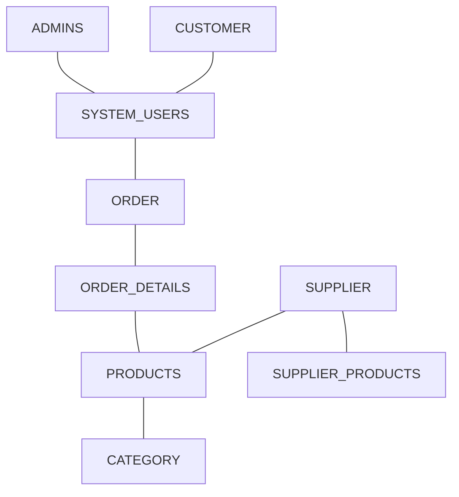
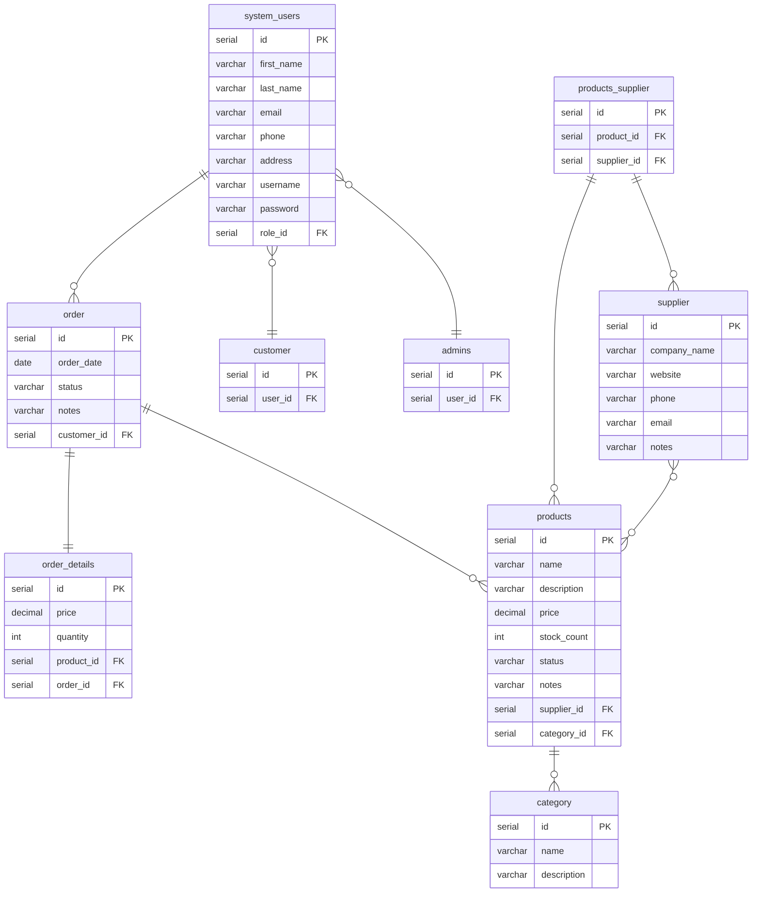

# DKGlassDesigns
A repository for DK Glass Designs COE Project.

## What is it?
An application to track stock for a glass design business. 
It can be used to view, filter, sort, add and update stock. It can also keep track of orders, order status and suppliers.

## How does it work? 
A user will be able to log into the system and create a new order. Once the order is created, the admin user will be able to view the order and amend the status. An admin user will be able to view the current stock levels of products, the current orders, order status and current suppliers. A user should be able to sort and filter all lists. An admin user will be able to add information to all tables, such as details on the products and suppliers. They will also be able to update the status of any orders on the system. 

### MVP
- Create a user account
- Create orders
- Modify order status, suppliers, prices and discounts
- View and track order status 

### Stretch Goals
- Add images for stock items
- Add restock level alerts

### Domain Model


### ER Diagram


### API Specification
#### USERS
`GET /users` 
Return a list of all users

Response 200
```json
[
  {
    "id": 1,
    "first_name": "Kerry",
    "last_name": "Kennedy",
    "email": "kerrytkennedy@hotmail.com",
    "phone": "07584916321",
    "address": "78 Wellington Park Drive",
    "username": "KerryK0517",
  },
  {
    "id": 2,
    "first_name": "Joe",
    "last_name": "Bloggs",
    "email": "joebloggs@email.com",
    "phone": "07845711239",
    "address": "123 Test Street",
    "username": "JBloggs2",
  }
]
```
---
`GET /user/{user_id}`
Return a user

Response 200
```json
{
    "id": 1,
    "first_name": "Kerry",
    "last_name": "Kennedy",
    "email": "kerrytkennedy@hotmail.com",
    "phone": "07584916321",
    "address": "78 Wellington Park Drive",
    "username": "KerryK0517",
}
```
---
`POST /user`
Create a user
```json
{
    "id": 1,
    "first_name": "Kerry",
    "last_name": "Kennedy",
    "email": "kerrytkennedy@hotmail.com",
    "phone": "07584916321",
    "address": "78 Wellington Park Drive",
    "username": "KerryK0517",
    "password": "passWord123"
}
```
Response - `201 Created`

---
`PUT /users/{user_id}`
Update a user by id

Request
```json
{
"password": "password2"
}
```
Response - `200 OK`

---

`DELETE /users/{user_id}`
Delete a user by id

Response - `204 No Content`

---
#### ORDERS
`GET /orders` 
Return a list of all orders

Response 200
```json
[
  {
     "id": 1,
     "order_date": "2023-04-14 14:29:20.012024",
     "status": "In Progress",
     "notes": "Testing notes field", 
     "customer_id": 1 
  },
  {
     "id": 2,
     "order_date": "2023-04-13 13:12:21.015423",
     "status": "Received",
     "notes": "Not started",
     "customer_id": 2 
  }
]
```
---
`GET /order/{order_id}`
Return an order

Response 200
```json
{
      "id": 1,
      "order_date": "2023-04-14 14:29:20.012024",
      "status": "In Progress",
      "notes": "Testing notes field",
      "customer_id": 1 
}
```
---
`POST /order`
Create an order
```json
{
      "id": 1,
      "order_date": "2023-04-14 14:29:20.012024",
      "status": "In Progress",
      "notes": "Testing notes field",
      "customer_id": 1 
}
```
Response - `201 Created`

---
`PUT /order/{order_id}`
Update an order by id

Request
```json
{
      "status": "Ready for collection"
}
```
Response - `200 OK`

---

`DELETE /order/{order_id}`
Delete an order by id

Response - `204 No Content`

---
#### PRODUCTS
`GET /products` 
Return a list of all products

Response 200
```json
[
  {
      "id": 1,
      "name": "small glass plaque",
      "description": "8x10 glass plaque",
      "price": 8.00,
      "stock_count": 12,
      "status": "In Stock", 
      "notes": "",
      "supplier_id": 1, 
      "category_id": 3
  },
  {
      "id": 2,
      "name": "Red Wine Glass",
      "description": "large wine glass",
      "price": 10.00,
      "stock_count": 10,
      "status": "In Stock",
      "notes": "",
      "supplier_id": 2,
      "category_id": 1
  }
]
```
---
`GET /product/{product_id}`
Return a product

Response 200
```json
{
      "id": 1,
      "name": "small glass plaque",
      "description": "8x10 glass plaque",
      "price": 8.00,
      "stock_count": 12,
      "status": "In Stock",
      "notes": "",
      "supplier_id": 1,
      "category_id": 3
}
```
---
`PUT /product/{product_id}`
Update a product by id

Request
```json
{
      "price": 11.00
}
```
Response - `200 OK`

---
---

`DELETE /product/{product_id}`
Delete a product by id

Response - `204 No Content`

---
#### SUPPLIERS
`GET /suppliers` 
Return a list of all suppliers

Response 200
```json
[
  {
      "id": 1,
      "company_name": "Glasses Direct", 
      "website": "www.glassesdirect.com",
      "phone": "0284612395",
      "email": "glassesdirect@email.com",
      "notes": "Largest range of wine glasses"
  },
  {
      "id": 2,
      "company_name": "Drinkstuff",
      "website": "www.drinkstuff.com",
      "phone": "02864174723",
      "email": "drinkstuff@email.co.uk",
      "notes": "Better for small orders"
  }
]
```
---
`GET /supplier/{supplier_id}`
Return a supplier

Response 200
```json
{
      "id": 1,
      "company_name": "Glasses Direct",
      "website": "www.glassesdirect.com",
      "phone": "0284612395",
      "email": "glassesdirect@email.com",
      "notes": "Largest range of wine glasses"
}
```
---

#### CATEGORIES
`GET /categories` 
Return a list of all categories

Response 200
```json
[
 {
       "id": 1,
       "name": "Red Wine Glass",
       "description": "Large wine glass" 
 },
 {
       "id": 3,
       "name": "Small Glass Plaque",
       "description": "8x10 glass plaque"
 }
]
```
---
`GET /category/{category_id}`
Return an order

Response 200
```json
{
      "id": 1,
      "name": "Red Wine Glass",
      "description": "Large wine glass" 
}
```
---
#### ORDER_DETAILS
`POST /order_details/{order_id}`
Create an order details for an order id 
```json
{
      "id": 1,
      "price": 8.00,
      "quantity": 1,
      "product_id": 1,
      "order_id": 1
}
```
Response - `201 Created`

---
